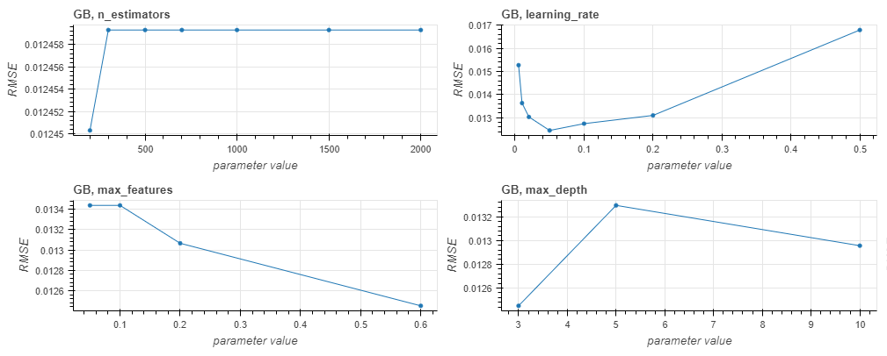
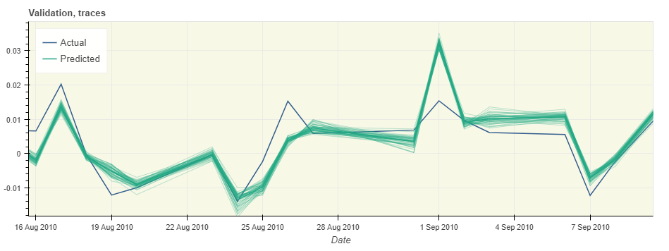

# ForecastML

A Python package for running experiments with machine learning regressors on time-series data.


## Features

* Adaboost, Gradient Boosting, Random Forest, Support Vector, XGBoost, (bidirectional) LSTM regression algorithms

* Detrending and seasonal decomposition using the STL algorithm

* Informative feature selection

* In-sample and out-of-sample forecast evaluation in terms of RMSE, MAE, MAPE

* Multiprocessing with the multiprocessing package

* Distributed processing with zmq and celery

* Visualization of validation runs

* Visualization of forecasted values


## Example usage

**Multiprocessing**

To run experiments with, e.g., AdaBoost, based on the settings for preprocessing and the learning algorithm specified in `settings.py`:

```
$ python run.py AdaBoost
```

Evaluation results are written to `results.json` and to a log file under `./logs`.

**ZeroMQ**

In one console:
```
$ python run_zmq.py LSTM
```

In a different console, possibly on several different machine(s):
```
$ python workers_zmq.py LSTM
```

Evaluation results are written by `run_zmq.py` to `results.json` and to a log file under `./logs`.

**Celery**

In one console:
```
$ python run_celery.py LSTM
```

In a different console, possibly on several different machine(s):
```
$ celery -A workers_celery worker
```

Evaluation results are written by `run_celery.py` to `results.json` and to a log file under `./logs`.


**Visualize validation results**

```
$ python validation_runs_viz.py GB
```

Retrieves validation results from `results.json` for the latest run of the Gradient Boosting regressor and produces plots showing forecast quality measures as a function of hyperparameter values, e.g.:



**Visualize forecast values**

```
$ python emp_intervals_viz.py GB
```

Produces plots with forecast values on the in-sample, validation, and out-of-sample sets. The plots include forecast confidence intervals and "traces" showing forecast values resulting from different random seed values. E.g.:




## Requirements

* numpy

* pandas

* sklearn

* statsmodels

* bokeh

* zmq (optional, required only for distributed processing)

* celery (optional, required only for distributed processing)

* [stldecompose](https://github.com/jrmontag/STLDecompose) (optional, required only for seasonal decomposition and detrending)

* [xgboost](http://xgboost.readthedocs.io/en/latest/python/python_intro.html) (optional, required only for XGBoost)

* [keras](https://keras.io/) (optional, required only for LSTM)

All the packages come installed with [Anaconda](https://conda.io/docs/user-guide/install/download.html), except celery, keras, stldecompose, and xgboost, which can be installed with conda or pip:

```
$ conda install -c conda-forge celery
$ conda install -c conda-forge xgboost
$ pip install stldecompose
```

To install keras, follow these [instructions](https://keras.io/#installation).


## Run tests

```
$ nosetests --logging-filter=-tensorflow,-matplotlib --with-coverage --cover-html --cover-package="utils,data,learner_configs" tests
```


## Data format

The expected format is CSV. The first column should be called "date" and the last column should contain the target (dependent) variable and be called "dep_var".

If detrending or seasonal decomposition should be used, the "date" column must contain all consecutive dates, without any missing entries for e.g., weekends.

See example data files in `./examples`.


## Example data

`examples/ise.csv`: Istanbul Stock Exchange data, the original version is available from [UCI Machine Learning Repository](http://archive.ics.uci.edu/ml/datasets/ISTANBUL+STOCK+EXCHANGE).

`examples/AirQualityUCI.csv`: Air Quality dataset, the original version is available from [UCI Machine Learning Repository](http://archive.ics.uci.edu/ml/datasets/Air+Quality).
